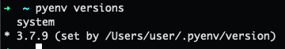

# 42School Norminette-V3 Installation Guide for MacOS

#### (🇫🇷  Version Française disponible ici : [Cocorico](https://github.com/ftputGuigz/Norminette_v3_MacOS_installation_guide/blob/master/fr.README.md) 🐓)

This little tutorial was designed to help you install Norminette v3 on MacOS. Let's proceed.

🛫  DON'T PANIC AND FASTEN YOUR SEATBELT. 🛬

## Why doesn't it work ? 🧐

Norminette V3 is written in Python3, so when you try to intall it on your Mac, it prioritizes use of the pre-installed Python3 of your system, which is often :  

1) Not the version you need
2) Non-editable/usable, due to system-related security issues

## Pre-requirement : Homebrew 🍺

Our solution uses Homebrew 🍺 , the fantastic package manager for macOS. 

Paste that in a macOS Terminal or Linux shell prompt if you haven't installed Homebrew yet :

```
/bin/bash -c "$(curl -fsSL https://raw.githubusercontent.com/Homebrew/install/HEAD/install.sh)"
```

## The Solution : pyenv 🐍
Our method uses **pyenv**, which is a simple but yet powerful python environment manager. It will allow us to choose which Python version the system will use when needed. 

1) We download pyenv via **Homebrew**, then we **initialize** pyenv through these commands: 
```
brew install pyenv
pyenv init
```
2) At this point it is also good to tell our `env` to _init_ **pyenv** everytime we boot the terminal, so depending on the shell you use (i'm using zsh so `~/zshrc` for me) :

```
echo 'eval "$(pyenv init -)"' >> ~/.zshrc
```

3) We install the Python3 version we need, for Norminette V3 it will be **3.7**. Enter the command :
```
pyenv install 3.7.9
```

At this point, `pyenv versions` command gives us : 


3) We "set" it on the python3 version we just downloaded with this command :
```
pyenv global 3.7.9
```

`pyenv versions`now gives us : 



## Eazy. 💯
### That's all Folks !
At this point, everything is done : just relaunch your Terminal and easily install [Norminette v3](https://github.com/42School/norminette)

🚀


