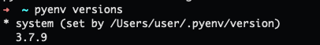
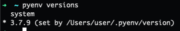

# Guide d'Installation de la Norminette-V3 de 42 sur macOS et Linux

#### (🇬🇧/🇺🇸  English Version ahead : [here](https://github.com/ftputGuigz/Norminette_v3_MacOS_installation_guide/blob/master/README.md) 🍔)
Ce guide a pour vocation de vous aider à installer la Norminette V3 sur ce (foutu) MacOS.

🛫  DON'T PANIC AND FASTEN YOUR SEATBELT. 🛬

## Pourquoi ça ne fonctionne pas ? 🧐

La Norminette V3 est écrite en Python3, donc lorsque que tu essayes de l'installer sur ton mac, celui-ci va essayer d'utiliser le Python3 pré-installé sur ton système, \
qui est souvent :
1) Pas la version dont tu as besoin
2) Non modifiable/utilisable pour des raisons de sécurité

## Pré-requis : Homebrew 🍺
Notre méthode utilise le fabuleux gestionnaire de paquets pour MacOS : 🍺 Homebrew 🍺

Homebrew s'installe avec la commande :

```
/bin/bash -c "$(curl -fsSL https://raw.githubusercontent.com/Homebrew/install/HEAD/install.sh)"
```

## La Solution : pyenv 🐍

Notre solution utilise tout simplement **pyenv** qui est un gestionnaire d'environnement python. Il nous permettra de choisir la version Python que le système utilise à l'installation d'un soft. 

1) On télécharge pyenv via **Homebrew**, puis on **initialise** pyenv : 
```
brew install pyenv
pyenv init
```

2) Ici, il est bien de signifier à notre `env` que l'on veut _init_ **pyenv** à chaque démarrage du terminal, donc en fonction du shell que vous utilisez (j'utilise zsh, donc `~/.zshrc` pour moi) : 

```
echo 'eval "$(pyenv init -)"' >> ~/.zshrc
```

3) On installe la version de python3 qui nous intéresse, ici la **3.7** :
```
pyenv install 3.7.9
```

La commande `pyenv versions` nous donne : 



3) Donc on "set" la version sur celle qu'on vient de télécharger via :
```
pyenv global 3.7.9
```

et la commande `pyenv versions`nous donne cette fois : 



## Eazy. 💯

### Voilà, c'est fait.
On relance son terminal et on installe tranquillement la [Norminette v3](https://github.com/42School/norminette) :)

🚀
